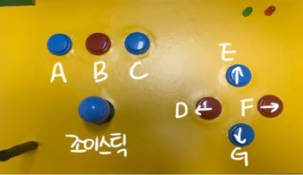
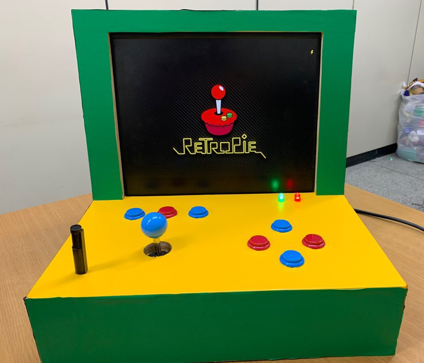
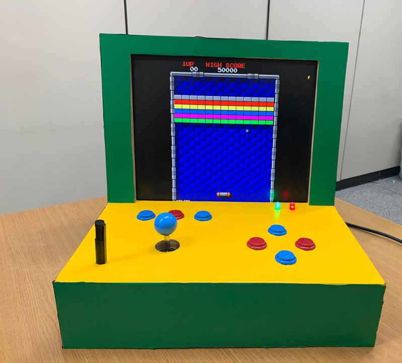
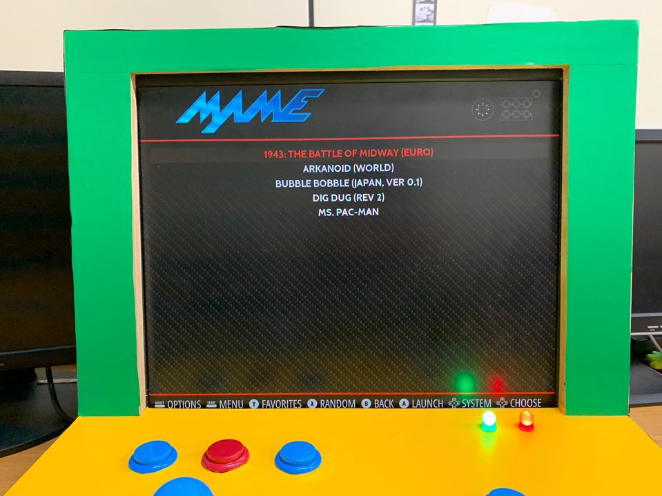
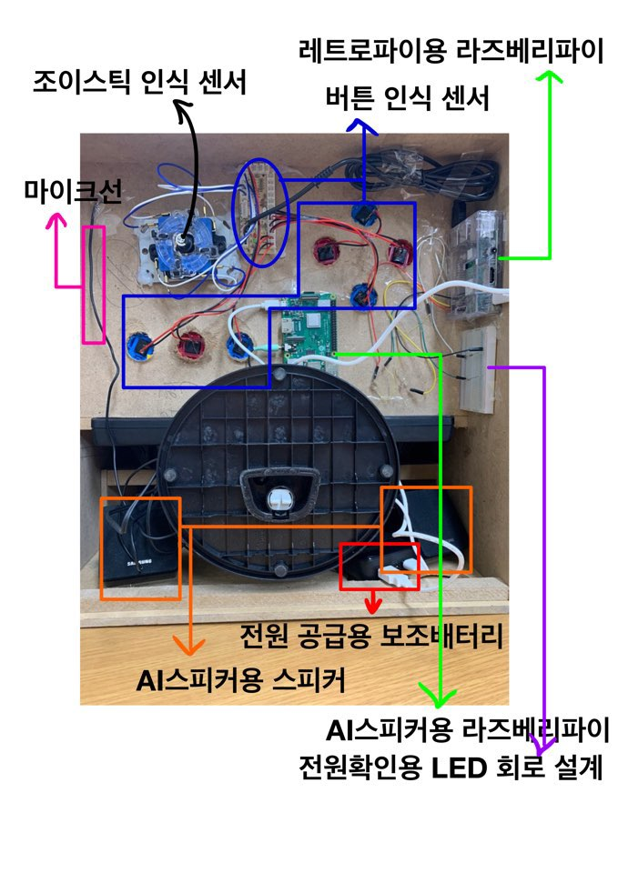
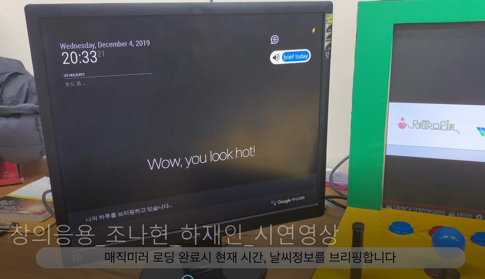

# NewtroGame
3학년 창의응용 수업 기말 프로젝트로 만든 프로젝트.  
레트로 파이를 활용한 오락실 게임기에 구글 어시스턴트 기반의 인공지능 스피커를 탑재한 뉴트로 게임기이다.   
레트로파이 게임기와 인공지능 스피커 모두 라즈베리파이를 통해 제작했다.  
'C언어 마리오게임'을 만든 후 제대로 된 게임기를 만들어보자 라는 마음으로 시작했다.  
> 레트로파이와 매직미러 API를 사용하여 내가 새롭게 개발한 것이 없어서 아쉬웠다.  

## 주제 선정 이유
새로움(New)과 회상(Rtro)의 합성어인 뉴트로(NEW-tro)는 2019년 가장 핫한 트렌드였다.   
우리도 이 트렌드에 맞춰 ‘어떻게 하면 우리의 전공인 라즈베리파이와 접목시킬 수 있을까’ 고민하였고  
라즈베리파이를 이용하여 음성인식스피커와 옛날 오락실 게임기를 결합시킨 뉴트로 게임기를 만들고자 하였다.  

## 프로젝트 목표
최종 목표는 라즈베리 활용 능력을 향상시키는 것이다.  
세분화시키면 다음과 같다.  
1. 라즈베리파이의 다양한 OS 활용하기  
> 레트로게임기는 레트로파이 OS를 사용하고 음성인식스피커는 라즈비안OS 를 사용한다. 
> 이 두 개를 결합시키면서 두 가지의 OS를 활용하는 법을 터득하고자 한다.  

2. OPEN API 활용 능력 향상하기  
> 음성인식스피커를 개발하는 과정에서 구글어시스턴트에서 개발한 ‘매직미러’라는 OPEN API를 사용하게 된다. 
> 이 과정에서 OPEN API 활용 능력을 향상시키고자 한다.

3. 회로 설계 능력 향상하기  
> 게임패드를 제작하는 과정에서 LED, 조이스틱, 버튼을 설계하며 회로 설계능력을 향상시키고자 한다.  

## 기능
1. 돈을 지불하지 않아도 코인버튼을 누르면 조이스틱과 버튼을 통해 게임이 가능하다.
2. 게임의 종류는 총 5 개이며, 원하는 종류의 게임을 이용할 수 있다.
3. 게임을 하며 마이크를 통해 게임기에 탑재된 AI 스피커에게 음성으로 명령을 할 수 있다.  
(예 : 날씨, 음악 재생, 대화 나누기 등)  
4. 레트로파이 게임 기능은 별도의 와이파이나 유선 인터넷이 없이도 실행 가능하다. 
5. 보조배터리를 통해 전원을 공급하므로 별도의 유선 연결을 필요로 하지 않는다.
6. 게임패드 우측 상단의 LED를 통해 라즈베리파이의 동작 여부를 판단할 수 있다.  
( ON : 라즈베리파이 작동 O  OFF : 라즈베리파이 작동 X)  
    
7. 
  A 버튼 : SELECT 및 게임 시작 명령을 수행한다.  
  B 버튼 : 코인 추가 명령을 수행한다.  
  C 버튼 : 게임 모드 선택 명령을 수행한다.  
　조이스틱 및 D, E, F, G 버튼 : 게임 캐릭터의 상하좌우 이동 명령을 수행한다.  
8. 게임기의 전원이 처음 켜졌을 때, 음성인식스피커가 현재 시각, 날짜 등을 말해준다.  
9. 음성인식스피커는 “smart mirror” 라는 명령어를 먼저 불러야 인식이 된다.  

## 기대효과
1. 뉴트로 트렌드에 열광하는 20대들에게 최신 기술인 AI 스피커가 탑재된 레트로 게임기는 많은 주목을 받을 것이다.  
2. 별도의 유선 전원 연결 없이 보조 배터리를 통해 레트로파이 게임 이용이 가능하다.  
3. 게임기는 별도의 와이파이나 유선 인터넷 없이 이용이 가능하다.  
4. 현재 탑재된 게임 이외의 추가적으로 게임을 등록할 수 있다.  

## 프로젝트 사진
  
  
  
  
  
